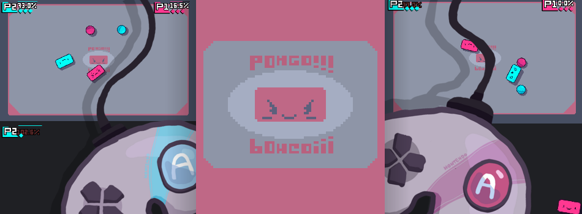

# PONGO!!!

A local multiplayer game that mixes pong and super smash bros! Make your sphere hit your opponent to send it off screen. The more damage you have, the further you will be launched when hit so be careful! You can also hold your boost button to hit your sphere with more power or dodge your enemy. Made with Godot Engine!

[Click here to play on Itch.io!!!](https://savi.itch.io/pongo)

Controls:
- Wasd/Arrow keys - move
- G/Space - boost
- Esc - Pause

Feel free to send feedback on [Itch.io](https://savi.itch.io/pongo) or [Twitter](https://twitter.com/savidev2). 

## Credits

Music:
- "Bossa Pause Menu" by [Joth](https://twitter.com/joth_music)
- "Battle Theme" by [Ville Nousiainen](http://soundcloud.com/mutkanto) 

Sound Effects:
- [Iwan Gabovitch (qubodup)](https://opengameart.org/users/qubodup) 
- [Unnamed](https://opengameart.org/users/unnamed)
- [Lamoot](https://opengameart.org/users/lamoot)
